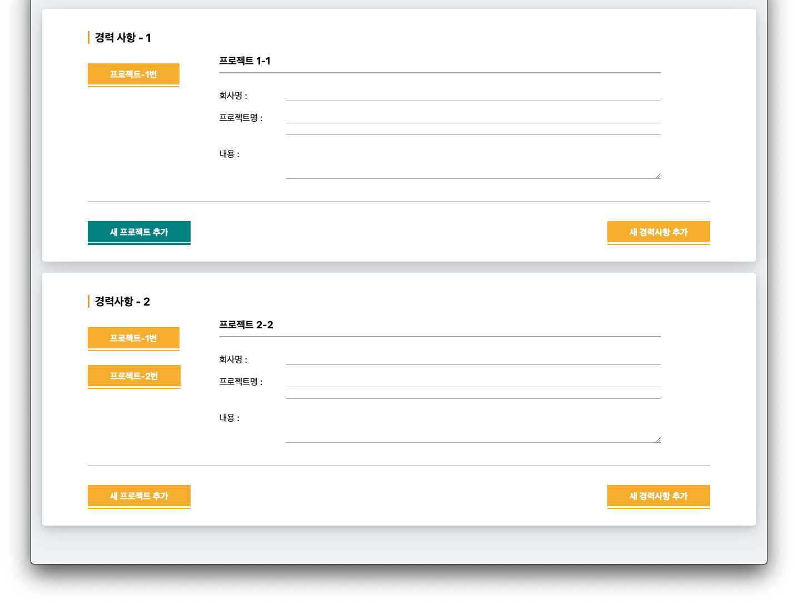

# UI-경력사항 (ui-job-history)

[ DEMO ] : <https://mj-seok.com/ui-job-history/>

- 리스트가 추가되는 경력사항 UI  
    2차원 배열에 담아 경력사항을 세로 인덱스, 프로젝트를 가로 인덱스에 저장
- 새 프로젝트 추가 기능
- 새 경력사항 추가 기능

> Pure Javascript, CSS3, HTML5

## 미리보기 Preview

## 파일 목록

- index.html
- maker.js
- style.css

---

> 행복UI
